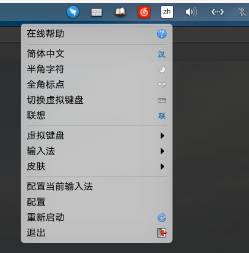

# Wingpanel Ayatana-Compatibility Indicator (Community Version)

# Description:
Keep compatibility with ubuntu/unity indicators on Patapua OS wingpanel.
If you want to install applications with indicators like weather forecast, redshift, social networks... this plug-in let these indicators appear in your panel.

<!-- <p align="center"> </p> -->

**Important:** 
1. To add support for Legacy icons (Wine, PlayOnLinux) see here:  
   [msmaldi/wingpanel-indicator-na-tray](https://github.com/msmaldi/wingpanel-indicator-na-tray)
2. this project fork from here :   
[Lafydev](https://github.com/Lafydev/wingpanel-indicator-ayatana) grateful for her 
## Dependencies
You'll need the following dependencies :  
  ```bash
  sudo apt-get install libglib2.0-dev libgranite-dev libindicator3-dev
  sudo apt-get install libwingpanel-dev indicator-application
  ```

- use indicator-appliction modified by myself for more feature(like left-click event, needless to add Pantheon parameters describeed bellow)  
   you can download here:
  [my-indicator-application](https://github.com/anzyelay/indicator-application/tree/master)

# Easy Install (user only)
1. Download the deb file  and launch install:
    ```bash
    sudo dpkg -i ./wingpanel-indicator-ayatana*.deb
    ```

2. Parameters for Pantheon (skip if using **my-indicator-application**)
    
    You need to add Pantheon to the list of desktops abled to work with indicators :<br/>

  - With autostart (thanks to JMoerman)

      just add /usr/lib/x86_64-linux-gnu/indicator-application/indicator-application-service as custom command to the auto start applications in the system settings.
      >   System settings -> "Applications" -> "Startup" -> "Add Startup App…" -> "Type in a custom command".

  - With the terminal (thanks to ankurk91)

      Open Terminal and run the following commands.
      ```bash
      mkdir -p ~/.config/autostart
      cp /etc/xdg/autostart/indicator-application.desktop ~/.config/autostart/
      sed -i 's/^OnlyShowIn.*/OnlyShowIn=Unity;GNOME;Pantheon;/' ~/.config/autostart/indicator-application.desktop
      ```

  - Editing files (change system settings!)

      ```sudo vi /etc/xdg/autostart/indicator-application.desktop```  

      Search the parameter: OnlyShowIn= and add "Pantheon" at the end of the line:  
      >OnlyShowIn=Unity;GNOME;Pantheon;  

      Save your changes (`:wq` save the changes).

3. reboot

# Build and install (developer)

1. Download the last release (zip) and extract files 

2. install Dependencies 

    You'll need all the dependencies from easy install and these to build : 
    ```bash
    sudo apt-get install valac gcc meson
    ```

3. Build with meson

    Open a Terminal in the extracted folder, build your application with meson and install it with ninja:<br/>
    ```bash
    meson build --prefix=/usr
    cd build
    ninja
    sudo ninja install
    ```

4. Follow step 2 from easy install (parameters) and reboot.

## uninstall
Open a terminal in the build folder.
```bash
sudo ninja uninstall
```

Reboot or restart wingpanel : 
Version Odin(6): <pre>killall io.elementary.wingpanel</pre>

# requirement settings by some application 
1. for netease-cloud-music, you should change the desktop file as follow
    ```sh
    sed -ri 's/^Exec=(.*)/Exec=env XDG_CURRENT_DESKTOP=Unity \1/g' /usr/share/applications/netease-cloud-music.desktop
    ```

